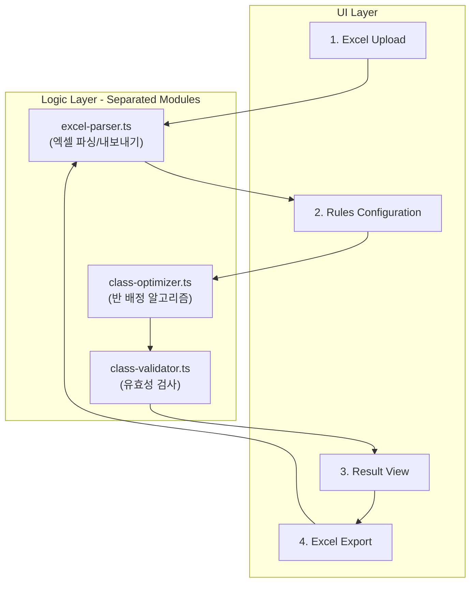

# Class Optimize 페이지 구현

## 아키텍처 개요




## 데이터 모델 (`src/lib/class-optimize/types.ts`)

```typescript
// 학생 데이터
interface Student {
  name: string;
  grade: number;
  classNum: number;  // 기존 반
  number: number;    // 번호
  score: number;     // 성적
  id: string;        // "grade-classNum-number" 형태로 자동 생성
}

// 배치 규칙
interface PlacementRule {
  id: string;
  type: 'no_together' | 'separate_1_to_n' | 'same_name_separate';
  priority: number;  // 우선순위 (낮을수록 높은 우선순위)
  studentIds: string[];  // 관련 학생 ID 목록
  label?: string;
}

// 배치 결과
interface ClassAssignment {
  classNum: number;
  students: Student[];
  averageScore: number;
}

// 유효성 검사 결과
interface ValidationViolation {
  rule: PlacementRule;
  involvedStudents: Student[];
  assignedClass: number;
  message: string;  // ex) "XXX 학생과 같이 있으면 안됩니다."
}
```

## 핵심 로직 모듈 (배치/검증 분리)

### 1. Excel 파서 - `src/lib/class-optimize/excel-parser.ts`

- **라이브러리**: `xlsx` (SheetJS) 추가 필요
- 엑셀 파일 파싱: 이름 | 학년 | 반 | 번호 | 성적 열 구조
- `Student[]` 배열로 변환, `id` 자동 생성 ("학년-반-번호")
- 결과 엑셀 내보내기: 배정 결과 + 위반 사항 표시 열 포함

### 2. 배치 알고리즘 - `src/lib/class-optimize/class-optimizer.ts`

- **입력**: `Student[]`, 목표 반 수, `PlacementRule[]` (우선순위 정렬)
- **알고리즘 흐름**:
  1. 학생들을 성적순으로 정렬
  2. Snake draft 방식으로 초기 배치 (성적 균등 분배)
  3. 우선순위 순으로 규칙 적용하여 학생 swap
  4. swap 후 성적 균등성이 크게 깨지지 않는 범위 내에서만 허용
- **출력**: `ClassAssignment[]`

### 3. 유효성 검사 - `src/lib/class-optimize/class-validator.ts`

- **입력**: `ClassAssignment[]`, `PlacementRule[]`
- 배치 결과에 대해 모든 규칙을 순회하며 위반 사항 검출
- **출력**: `ValidationViolation[]`
- 배치 로직과 완전히 독립적으로 동작 (결과만 받아서 검증)

## UI 구성 (단계별 Wizard 형태)

### 페이지 파일: [src/pages/class-optimize.tsx](src/pages/class-optimize.tsx)

- 전체 페이지 상태 관리 (`useState`로 step, students, rules, results 관리)
- 4단계 step indicator로 진행 상황 표시

### Step 1: 엑셀 업로드

- 파일 드래그앤드롭 / 클릭 업로드 영역
- 업로드 후 학생 목록 미리보기 테이블 (`@tanstack/react-table` 활용)
- 목표 반 수 입력 필드

### Step 2: 규칙 설정

- 규칙 타입 3가지:
  - **붙이면 안되는 학생들**: 학생 2명 이상 선택 (같은 반 배정 금지)
  - **분리 필요학생 1:N**: 기준 학생 1명 + 분리 대상 N명 선택
  - **동명이인 분리**: 체크박스 on/off (자동으로 동명이인 감지)
- 각 규칙에 우선순위 번호 부여 (드래그로 순서 변경 or 숫자 입력)
- 학생 선택 시 학년-반-번호로 검색/선택 가능한 combobox

### Step 3: 배치 실행 및 결과 확인

- "배치 실행" 버튼 클릭 시 알고리즘 실행
- 결과 테이블: 반별 학생 목록, 반별 평균 성적, 학생 수
- 위반 사항 목록: 규칙별로 어떤 학생이 위반되었는지 표시 (경고 UI)
- 반별 성적 분포 요약 (평균, 최고, 최저)

### Step 4: 엑셀 내보내기

- 배치 결과를 엑셀로 다운로드
- 위반 사항이 있는 학생 행에 별도 열로 위반 내용 표시

## 추가 필요 shadcn 컴포넌트

아래 shadcn 컴포넌트를 추가 설치:

- `input`, `label`, `card`, `badge`, `separator`
- `table` (TanStack Table wrapper용)
- `dialog`, `select`, `checkbox`, `tabs`
- `alert` (위반 사항 표시용)
- `command` (학생 검색/선택 combobox용)

## 새로운 npm 의존성

- `xlsx` (SheetJS): 엑셀 파일 읽기/쓰기

## 파일 구조

```
src/lib/class-optimize/
├── types.ts              # 데이터 타입 정의
├── excel-parser.ts       # 엑셀 파싱/내보내기
├── class-optimizer.ts    # 배치 알고리즘
└── class-validator.ts    # 유효성 검사

src/pages/
└── class-optimize.tsx    # 메인 페이지 (기존 파일 수정)

src/components/
└── class-optimize/
    ├── step-upload.tsx       # Step 1: 엑셀 업로드
    ├── step-rules.tsx        # Step 2: 규칙 설정
    ├── step-result.tsx       # Step 3: 결과 확인
    ├── step-export.tsx       # Step 4: 내보내기
    ├── student-table.tsx     # 학생 목록 테이블
    ├── rule-editor.tsx       # 규칙 편집 컴포넌트
    └── violation-alert.tsx   # 위반 사항 표시
```

